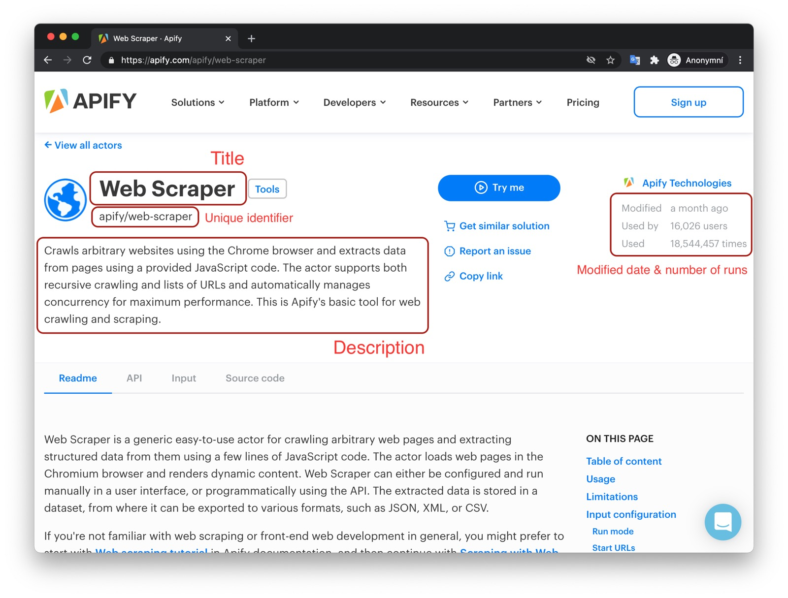
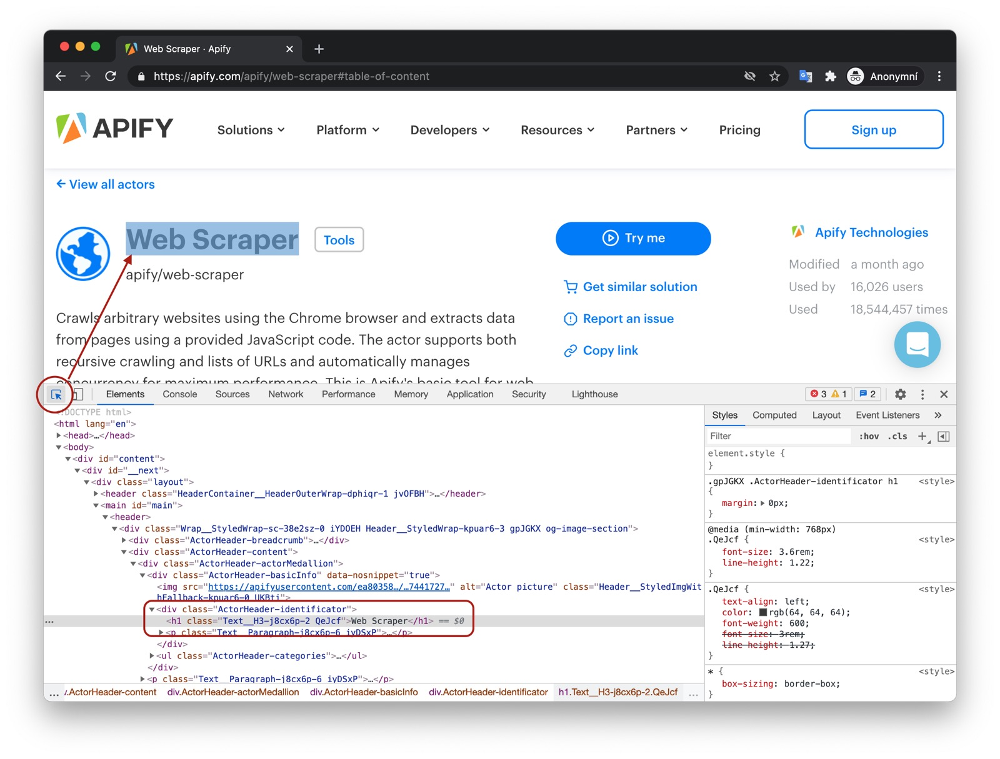
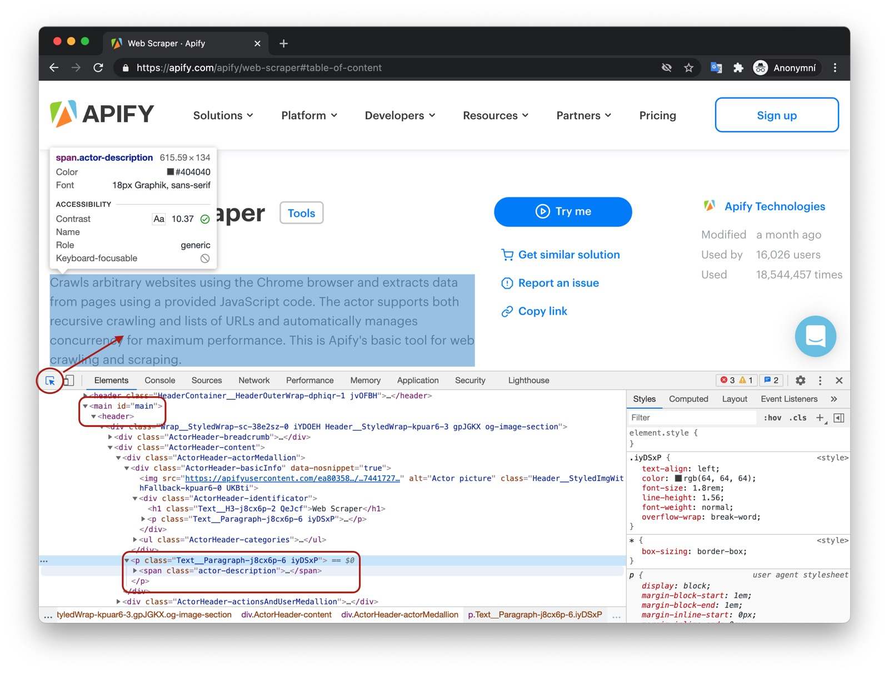
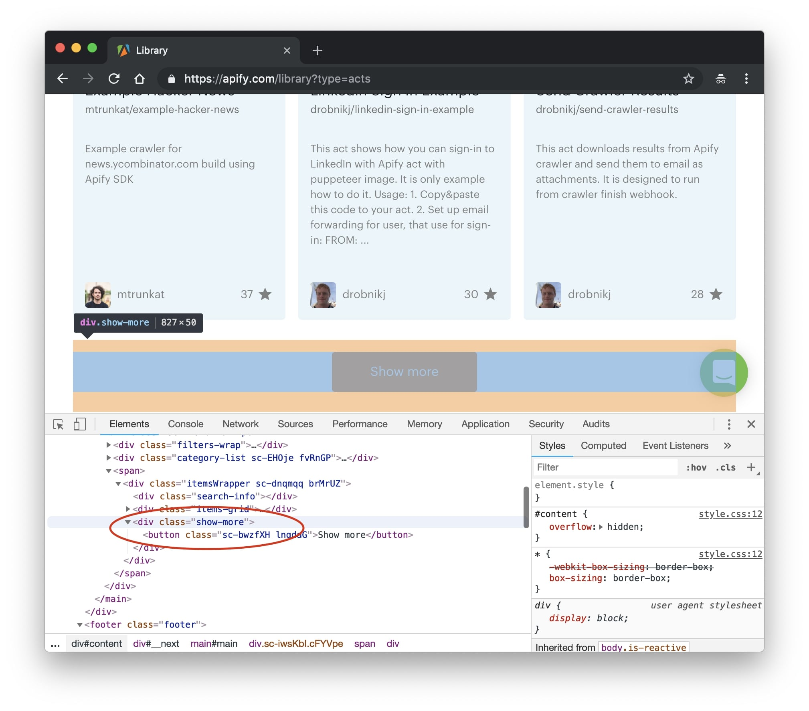

# Scraping with Puppeteer Scraper
This scraping tutorial will go into the nitty gritty details of extracting data from `https://apify.com/store` 
using the `apify/puppeteer-scraper`. If you arrived here from the [Getting started with Apify scrapers](https://apify.com/docs/scraping/tutorial/introduction),
tutorial, great! You are ready to continue where we left off. If you haven't seen the Getting started yet,
check it out, it will help you learn about Apify and scraping in general and set you up for this tutorial,
because this one builds on topics and code examples discussed there.

## Getting to know our tools
In the [Getting started with Apify scrapers](https://apify.com/docs/scraping/tutorial/introduction) tutorial, we've confirmed that the scraper works as expected,
so now it's time to add more data to the results.

To do that, we'll be using the [`Puppeteer` library](https://github.com/GoogleChrome/puppeteer). Puppeteer is a browser
automation library that allows you to control a browser using JavaScript. That is, simulate a real human sitting
in front of a computer, using a mouse and a keyboard. It gives you almost unlimited possibilites, but you need to learn
quite a lot before you'll be able to use all of its features. We'll walk you through some of the basics of Puppeteer,
so that you can start using it for some of the most typical scraping tasks, but if you really want to master it,
you'll need to visit its [documentation](https://pptr.dev/) and really dive deep into its intricacies.

> The purpose of Puppeteer Scraper is to remove some of the difficulty faced when using Puppeteer by wrapping
it in a nice, manageable UI. It provides almost all of its features in a format that is much easier to grasp
when first trying to scrape using Puppeteer.

### Web Scraper differences
At first glance, it may seem like Web Scraper and Puppeteer Scraper are almost the same. Well, they are.
In fact, Web Scraper uses Puppeteer underneath. The difference is the amount of control they give you.
Where Web Scraper only gives you access to in-browser JavaScript and the `pageFunction` is executed
in the browser context, Puppeteer Scraper's `pageFunction` is executed in Node.js context, giving you
much more freedom to bend the browser to your will. You're the puppeteer and the browser is your puppet.
It's also much easier to work with external APIs, databases or the [Apify SDK](https://sdk.apify.com)
in the Node.js context. The tradeoff is simple. Power vs simplicity. Web Scraper is simple,
Puppeteer Scraper is powerful (and the [Apify SDK](https://sdk.apify.com) is super-powerful).

> Simply put, Web Scraper `pageFunction` is just a single 
[page.evaluate()](https://pptr.dev/#?product=Puppeteer&show=api-pageevaluatepagefunction-args) call.

Now that's out of the way, let's open one of the actor detail pages in the Store, for example the
[`apify/web-scraper`](https://apify.com/apify/web-scraper) page and use our DevTools-Fu to scrape some data.

> If you're wondering why we're using `apify/web-scraper` as an example instead of `puppeteer-scraper`,
it's only because we didn't want to triple the number of screenshots we needed to make. Lazy developers!

## Quick recap
Before we start, let's do a quick recap of the data we chose to scrape:

   1. **URL** - The URL that goes directly to the actor's detail page.
   2. **Unique identifier** - Such as `apify/web-scraper`.
   3. **Title** - The title visible in the actor's detail page.
   4. **Description** - The actor's description.
   5. **Last run date**- When the actor was last run.
   6. **Number of runs** - How many times the actor was run.
   


We've already scraped number 1 and 2 in the [Getting started with Apify scrapers](https://apify.com/docs/scraping/tutorial/introduction)
tutorial, so let's get to the next one on the list: Title

### Title


Let's start really easy. By using the element selector tool, we find out that the title is there under an `<h1>` tag,
as titles should be.

> Remember that you can press CTRL+F (CMD+F) in the Elements tab of DevTools to open the search bar where you can quickly search for elements using
> their selectors. And always make sure to use the DevTools to verify your scraping process and assumptions. It's faster than changing the crawler
> code all the time.

To get the title we just need to find it:

```js
// Using Puppeteer
const title = await page.$eval('h1', (el => el.textContent));

return {
    title,
}
```
The [`page.$eval`](https://pptr.dev/#?product=Puppeteer&show=api-elementhandleevalselector-pagefunction-args-1)
function allows you to run a function in the browser, with the selected element as the first argument.
Here we use it to extract the text content of a `h1` element that's in the page. The return value of the function
is automatically passed back to the Node.js context, so we receive an actual `string` with the element's text.

### Description
Getting the actor's description is a little more involved, but still pretty straightforward. We can't just simply search for a `<p>` tag, because
there's a lot of them in the page. We need to narrow our search down a little. Using the DevTools we find that the actor description is nested within
the `<header>` element, which is nested itself in the `<main>` element. Sadly, we're still left with two `<p>` tags. To finally select only the
description, we choose the `<p>` tag that has a `class` that starts with `Text__Paragraph`.



```js
const title = await page.$eval('h1', (el => el.textContent));
const description = await page.$eval('main header p[class^=Text__Paragraph]', (el => el.textContent));

return {
    title,
    description
};
```

### Last run date
The DevTools tell us that the `lastRunDate` can be found in the second of the two `<time>` elements in the page.


```js
const title = await page.$eval('h1', (el => el.textContent));
const description = await page.$eval('main header p[class^=Text__Paragraph]', (el => el.textContent));

const lastRunTimestamp = await page.$$eval('time', (els) => els[1].getAttribute('datetime'));
const lastRunDate = new Date(Number(lastRunTimestamp));

return {
    title,
    description,
    lastRunDate,
};
```
Similarly to `page.$eval`, the [`page.$$eval`](https://pptr.dev/#?product=Puppeteer&show=api-elementhandleevalselector-pagefunction-args)
function runs a function in the browser, only this time, it does not provide
you with a single `Element` as the function's argument, but rather with an `Array` of `Elements`. Once again,
the return value of the function will be passed back to the Node.js context.

It might look a little too complex at first glance, but let me walk you through it. We find all the `<time>` elements. There are two, so we grab the
second one using the `.eq(1)` call (it's zero indexed) and then we read its `datetime` attribute, because that's where a unix timestamp is stored as a
`string`.

But we would much rather see a readable date in our results, not a unix timestamp, so we need to convert it. Unfortunately the `new Date()`
constructor will not accept a `string`, so we cast the `string` to a `number` using the `Number()` function before actually calling `new Date()`.
Phew!

### Run count
And so we're finishing up with the `runCount`. There's no specific element like `<time>`, so we need to create
a complex selector and then do a transformation on the result.

```js
const title = await page.$eval('h1', (el => el.textContent));
const description = await page.$eval('main header p[class^=Text__Paragraph]', (el => el.textContent));

const lastRunTimestamp = await page.$$eval('time', (els) => els[1].getAttribute('datetime'));
const lastRunDate = new Date(Number(lastRunTimestamp));

const runCountText = await page.$eval('ul.stats li:nth-of-type(3)', (el => el.textContent));
const runCount = Number(runCountText.match(/\d+/)[0]);

return {
    title,
    description,
    lastRunDate,
    runCount,
};
```

The `ul.stats > li:nth-of-type(3)` looks complicated, but it only reads that we're looking for a `<ul class="stats ...">` element and within that
element we're looking for the third `<li>` element. We grab its text, but we're only interested in the number of runs. So we parse the number out
using a regular expression, but its type is still a `string`, so we finally convert the result to a `number` by wrapping it with a `Number()` call.

### Wrapping it up
And there we have it! All the data we needed in a single object. For the sake of completeness, let's add
the properties we parsed from the URL earlier and we're good to go.

```js
const { url } = request;

// ...

const uniqueIdentifier = url.split('/').slice(-2).join('/');

const title = await page.$eval('h1', (el => el.textContent));
const description = await page.$eval('main header p[class^=Text__Paragraph]', (el => el.textContent));

const lastRunTimestamp = await page.$$eval('time', (els) => els[1].getAttribute('datetime'));
const lastRunDate = new Date(Number(lastRunTimestamp));

const runCountText = await page.$eval('ul.stats li:nth-of-type(3)', (el => el.textContent));
const runCount = Number(runCountText.match(/\d+/)[0]);

return {
    url,
    uniqueIdentifier,
    title,
    description,
    lastRunDate,
    runCount,
};
```

All we need to do now is add this to our `pageFunction`:

```js
async function pageFunction(context) {
    const { request, log, skipLinks, page } = context; // page is Puppeteer's page

    if (request.userData.label === 'START') {
        log.info('Store opened!');
        // Do some stuff later.
    }
    if (request.userData.label === 'DETAIL') {
        const { url } = request;
        log.info(`Scraping ${url}`);
        await skipLinks();

        // Do some scraping.
        const uniqueIdentifier = url.split('/').slice(-2).join('/');

        // Get attributes in parallel to speed up the process.
        const titleP = page.$eval('h1', (el => el.textContent));
        const descriptionP = page.$eval('main header p[class^=Text__Paragraph]', (el => el.textContent));
        const lastRunTimestampP = page.$$eval('time', (els) => els[1].getAttribute('datetime'));
        const runCountTextP = page.$eval('ul.stats li:nth-of-type(3)', (el => el.textContent));

        const [title, description, lastRunTimestamp, runCountText] = await Promise.all([titleP, descriptionP, lastRunTimestampP, runCountTextP]);

        const lastRunDate = new Date(Number(lastRunTimestamp));
        const runCount = Number(runCountText.match(/\d+/)[0]);

        return {
            url,
            uniqueIdentifier,
            title,
            description,
            lastRunDate,
            runCount,
        };
    }
}
```
> You have definitely noticed that we changed up the code a little bit. This is because the back and forth communication
between Node.js and browser takes some time and it slows down the scraper. To limit the effect of this, we changed
all the functions to start at the same time and only wait for all of them to finish at the end. This is called
concurrency or parallelism. Unless the functions need to be executed in a specific order, it's often a good idea
to run them concurrently to speed things up.

### Test run 3
As always, try hitting that **Save & Run** button  and visit 
the Dataset preview of clean items. You should see a nice table of all the attributes correctly scraped.
You nailed it!

## Pagination
Pagination is just a term that represents "going to the next page of results". You may have noticed that we did not
actually scrape all the actors, just the first page of results. That's because to load the rest of the actors,
one needs to click the orange **Show more** button at the very bottom of the list. This is pagination.

> This is a typical JavaScript pagination, sometimes called infinite scroll. Other pages may just use links
that take you to the next page. If you encounter those, just make a Pseudo URL for those links and they will
be automatically enqueued to the request queue. Use a label to let the scraper know what kind of URL it's processing.

### Waiting for dynamic content
Before we talk about paginating, we need to have a quick look at dynamic content. Since the Apify Store is a JavaScript
application (as many, if not most modern websites are), the button might not exist in the page when the scraper
runs the `pageFunction`.

How is this possible? Because the scraper only waits with executing the `pageFunction` for the page to load its HTML.
If there's additional JavaScript that modifies the DOM afterwards, the `pageFunction` may execute before this
JavaScript had the time to run.

At first, you may think that the scraper is broken, but it just cannot wait for all the JavaScript in the page
to finish executing. For a lot of pages, there's always some JavaScript executing or some network requests being made.
It would never stop waiting. It is therefore up to you, the programmer, to wait for the elements you need.
Fortunately, we have an easy solution.

#### The `context.page.waitFor()` function
`waitFor()` is a function that's available on the Puppeteer `page` object that's in turn available on
the `context` argument of the  `pageFunction` (as you already know from previous chapters). It helps you with,
well, waiting for stuff. It accepts either a number of milliseconds to wait, a selector to await in the page,
or a function to execute. It will stop waiting once the time elapses, the selector appears or the provided function
returns `true`.

> See [`page.waitFor()`](https://pptr.dev/#?product=Puppeteer&show=api-pagewaitforselectororfunctionortimeout-options-args)
in the Puppeteer documentation.

```js
await page.waitFor(2000); // Waits for 2 seconds.
await page.waitFor('#my-id'); // Waits until an element with id "my-id" appears in the page.
await page.waitFor(() => !!window.myObject); // Waits until a "myObject" variable appears on the window object.
```

The selector may never be found and the function might never return `true`, so the `page.waitFor()` function also has
a timeout. The default is `30` seconds. You can override it by providing an options object as the second parameter,
with a `timeout` property.

```js
await page.waitFor('.bad-class', { timeout: 5000 });
```

With those tools, you should be able to handle any dynamic content the website throws at you.

### How to paginate
With the theory out of the way, this should be pretty easy. The algorithm is a loop: 

   1. Wait for the **Show more** button.
   2. Click it.
   3. Is there another **Show more** button?
      - Yes? Repeat the above. (loop)
      - No? We're done. We have all the actors.

#### Waiting for the button
Before we can wait for the button, we need to know its unique selector. A quick look in the DevTools tells us 
that the button's class is some weird randomly generated string, but fortunately, there's an enclosing `<div>`
with a class of `show-more`. Great! Our unique selector:

```
div.show-more > button
```

> Don't forget to confirm our assumption in the DevTools finder tool (CTRL/CMD + F).



Now that we know what to wait for, we just plug it into the `waitFor()` function.

```js
await page.waitFor('div.show-more > button');
```

#### Clicking the button
We have a unique selector for the button and we know that it's already rendered in the page. Clicking it is a piece
of cake. We'll use the Puppeteer `page` again to issue the click. Puppeteer will actually simulate dragging the mouse
and making a left mouse click in the element. 

```js
await page.click('div.show-more > button');
```

This will show the next page of actors.

#### Repeating the process
We've shown two function calls, but how do we make this work together in the `pageFunction`?

```js
async function pageFunction(context) {

// ...

let timeout; // undefined
const buttonSelector = 'div.show-more > button';
while (true) {
    log.info('Waiting for the "Show more" button.');
    try {
        await page.waitFor(buttonSelector, { timeout }); // Default timeout first time.
        timeout = 2000; // 2 sec timeout after the first.
    } catch (err) {
        // Ignore the timeout error.
        log.info('Could not find the "Show more button", we\'ve reached the end.');
        break;
    }
    log.info('Clicking the "Show more" button.');
    await page.click(buttonSelector);
}

// ...

}
```

We want to run this until the `waitFor()` function throws, so that's why we use a `while(true)` loop. We're also not
interested in the error, because we're expecting it, so we just ignore it and print a log message instead.

You might be wondering what's up with the `timeout`. Well, for the first page load, we want to wait longer,
so that all the page's JavaScript has had a chance to execute, but for the other iterations, the JavaScript is 
already loaded and we're just waiting for the page to re-render so waiting for `2` seconds is enough to confirm
that the button is not there. We don't want to stall the scraper for `30` seconds just to make sure that there's
no button.

### Plugging it into the `pageFunction`
We've got the general algorithm ready, so all that's left is to integrate it into our earlier `pageFunction`. 
Remember the `// Do some stuff later` comment? Let's replace it.

```js
async function pageFunction(context) {
    const { request, log, skipLinks, page } = context;
    if (request.userData.label === 'START') {
        log.info('Store opened!');
        let timeout; // undefined
        const buttonSelector = 'div.show-more > button';
        while (true) {
            log.info('Waiting for the "Show more" button.');
            try {
                await page.waitFor(buttonSelector, { timeout }); // Default timeout first time.
                timeout = 2000; // 2 sec timeout after the first.
            } catch (err) {
                // Ignore the timeout error.
                log.info('Could not find the "Show more button", we\'ve reached the end.');
                break;
            }
            log.info('Clicking the "Show more" button.');
            await page.click(buttonSelector);
        }
    }

    if (request.userData.label === 'DETAIL') {
        const { url } = request;
        log.info(`Scraping ${url}`);
        await skipLinks();

        // Do some scraping.
        const uniqueIdentifier = url.split('/').slice(-2).join('/');

        // Get attributes in parallel to speed up the process.
        const titleP = page.$eval('h1', (el => el.textContent));
        const descriptionP = page.$eval('main header p[class^=Text__Paragraph]', (el => el.textContent));
        const lastRunTimestampP = page.$$eval('time', (els) => els[1].getAttribute('datetime'));
        const runCountTextP = page.$eval('ul.stats li:nth-of-type(3)', (el => el.textContent));

        const [title, description, lastRunTimestamp, runCountText] = await Promise.all([titleP, descriptionP, lastRunTimestampP, runCountTextP]);

        const lastRunDate = new Date(Number(lastRunTimestamp));
        const runCount = Number(runCountText.match(/\d+/)[0]);

        return {
            url,
            uniqueIdentifier,
            title,
            description,
            lastRunDate,
            runCount,
        };
    }
}
```

That's it! You can now remove the **Max pages per run** limit, **Save & Run** your task and watch the scraper paginate
through all the actors and then scrape all of their data. After it succeeds, open the Dataset again and see 
the clean items. You should have a table of all the actor's details in front of you. If you do, great job!
You've successfully scraped the Apify Store. And if not, no worries, just go through the code examples again,
it's probably just some typo.


## Downloading the scraped data
You already know the DATASET tab of the run console since this is where we've always previewed our data.
Notice that at the bottom, there is a table with multiple data formats, such as JSON, CSV or an Excel sheet,
and to the right, there are options to download the scraping results in any of those formats. Go ahead and try it.

> If you prefer working with an API, you can find an example in the API tab of the run console: **Get dataset items**.

### Items and Clean items
There are two types of data available for download. Items and Clean items. The Items will always include a record
for each `pageFunction` invocation, even if you did not return any results. The record also includes hidden fields
such as `#debug`, where you can find various information that can help you with debugging your scrapers.

Clean items, on the other hand, include only the data you returned from the `pageFunction`. If you're only interested
in the data you scraped, this format is what you will be using most of the time.

## Bonus: Making your code neater
You may have noticed that the `pageFunction` gets quite bulky. To make better sense of your code and have an easier
time maintaining or extending your task, feel free to define other functions inside the `pageFunction`
that encapsulate all the different logic. You can, for example, define a function for each of the different pages:

```js
async function pageFunction(context) {
    switch (context.request.userData.label) {
        case 'START': return handleStart(context);
        case 'DETAIL': return handleDetail(context);
    }

    async function handleStart({ log, page }) {
        log.info('Store opened!');
        let timeout; // undefined
        const buttonSelector = 'div.show-more > button';
        while (true) {
            log.info('Waiting for the "Show more" button.');
            try {
                await page.waitFor(buttonSelector, { timeout }); // Default timeout first time.
                timeout = 2000; // 2 sec timeout after the first.
            } catch (err) {
                // Ignore the timeout error.
                log.info('Could not find the "Show more button", we\'ve reached the end.');
                break;
            }
            log.info('Clicking the "Show more" button.');
            await page.click(buttonSelector);
        }
    }

    async function handleDetail({ request, log, skipLinks, page }) {
        const { url } = request;
        log.info(`Scraping ${url}`);
        await skipLinks();

        // Do some scraping.
        const uniqueIdentifier = url.split('/').slice(-2).join('/');

        // Get attributes in parallel to speed up the process.
        const titleP = page.$eval('h1', (el => el.textContent));
        const descriptionP = page.$eval('main header p[class^=Text__Paragraph]', (el => el.textContent));
        const lastRunTimestampP = page.$$eval('time', (els) => els[1].getAttribute('datetime'));
        const runCountTextP = page.$eval('ul.stats li:nth-of-type(3)', (el => el.textContent));

        const [title, description, lastRunTimestamp, runCountText] = await Promise.all([titleP, descriptionP, lastRunTimestampP, runCountTextP]);

        const lastRunDate = new Date(Number(lastRunTimestamp));
        const runCount = Number(runCountText.match(/\d+/)[0]);

        return {
            url,
            uniqueIdentifier,
            title,
            description,
            lastRunDate,
            runCount,
        };
    }
}
```

> If you're confused by the functions being declared below their executions, it's called hoisting and it's a feature
of JavaScript. It helps you put what matters on top, if you so desire.

## Bonus 2: Using jQuery with Puppeteer Scraper
If you're familiar with the [`jQuery` library](https://jquery.com/), you may have looked at the scraping code and thought
that it's unnecessarily complicated. That's probably up to everyone to decide on their own, but the good news is,
you can easily use `jQuery` with Puppeteer Scraper too.

### Injecting jQuery
To be able to use jQuery, we first need to introduce it to the browser. Fortunately, we have a helper function to
do just that: [`Apify.utils.puppeteer.injectJQuery`](https://sdk.apify.com/docs/api/puppeteer#puppeteer.injectJQuery)

> Just a friendly warning. Injecting `jQuery` into a page may break the page itself, if it expects a specific version
of `jQuery` to be available and you override it with an incompatible one. So, be careful.

You can either call this function directly in your `pageFunction`, or you can set up `jQuery` injection in the
**Pre goto function** in the INPUT UI.

```js
async function pageFunction(context) {
    const { Apify, page } = context;
    await Apify.utils.puppeteer.injectJQuery(page);
    
    // your code ...
}
```

```js
async function preGotoFunction({ page, Apify }) {
    await Apify.utils.puppeteer.injectJQuery(page);
}
```

The implementations are almost equal in effect. That means that in some cases, you may see performance differences,
or one might work while the other does not. Depending on the target website.

Let's try refactoring the Bonus 1 version of the `pageFunction` to use `jQuery`.

```js
async function pageFunction(context) {
    switch (context.request.userData.label) {
        case 'START': return handleStart(context);
        case 'DETAIL': return handleDetail(context);
    }

    async function handleStart({ log, page }) {
        log.info('Store opened!');
        let timeout; // undefined
        const buttonSelector = 'div.show-more > button';
        while (true) {
            log.info('Waiting for the "Show more" button.');
            try {
                await page.waitFor(buttonSelector, { timeout });
                timeout = 2000;
            } catch (err) {
                log.info('Could not find the "Show more button", we\'ve reached the end.');
                break;
            }
            log.info('Clicking the "Show more" button.');
            await page.click(buttonSelector);
        }
    }

    async function handleDetail({ request, log, skipLinks, page, Apify }) { // <-------- Destructure Apify.
        await Apify.utils.puppeteer.injectJQuery(page); // <-------- Inject jQuery.

        const { url } = request;
        log.info(`Scraping ${url}`);
        await skipLinks();

        // Do some scraping.
        const uniqueIdentifier = url.split('/').slice(-2).join('/');

        const results = await page.evaluate(() => { // <-------- Use jQuery only inside page.evaluate (inside browser).
            return {
                title: $('h1').text(),
                description: $('main header p[class^=Text__Paragraph]').text(),
                lastRunDate: new Date(
                    Number(
                        $('time')
                            .eq(1)
                            .attr('datetime'),
                    ),
                ),
                runCount: Number(
                    $('ul.stats li:nth-of-type(3)')
                        .text()
                        .match(/\d+/)[0],
                ),
            };
        })

        return {
            url,
            uniqueIdentifier,
            ...results, // <-------- Add results from browser to output.
        };
    }
}
```

> There's an important takeaway from the example code. You can only use jQuery in the browser scope, even though you're
injecting it outside of the browser. We're using the [`page.evaluate()`](https://pptr.dev/#?product=Puppeteer&show=api-pageevaluatepagefunction-args)
function to run the script in the context of the browser and the return value is passed back to Node.js. Keep this in mind.

## Final word
Thank you for reading this whole tutorial! Really! It's important to us that our users have the best information available to them so that they can use Apify easily and effectively. We're glad that you made it all the way here and congratulations on creating your first scraping task. We hope that you liked the tutorial and if there's anything you'd like to ask, [do it on Stack Overflow](https://stackoverflow.com/questions/tagged/apify)!

Finally, `apify/puppeteer-scraper` is just an actor and writing your own actors is a breeze with the [Apify SDK](https://sdk.apify.com). It's a bit more complex and involved than writing a simple `pageFunction`, but it allows you to fine-tune all the details of your scraper to your liking. Perhaps some other time, when you're in the mood for yet another tutorial, visit the [Getting Started](https://sdk.apify.com/docs/guides/gettingstarted). We think you'd like it!
